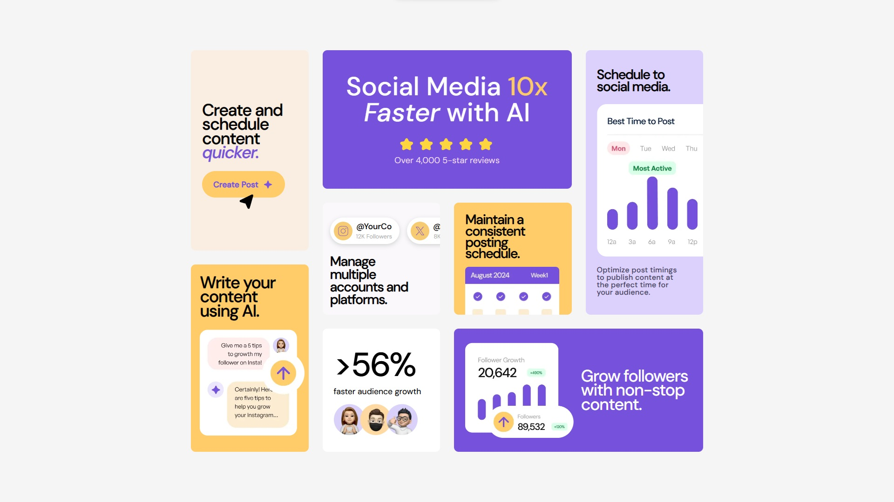

# Frontend Mentor - Bento grid solution

This is a solution to the [Bento grid challenge on Frontend Mentor](https://www.frontendmentor.io/challenges/bento-grid-RMydElrlOj). Frontend Mentor challenges help you improve your coding skills by building realistic projects. 

## Overview

### The challenge

Users should be able to:

- View the optimal layout for the interface depending on their device's screen size

### Screenshot

### Desktop Preview

### Mobile Preview

### Links

- Solution URL: [View My Solution on Frontend Mentor](https://www.frontendmentor.io/solutions/responsive-landing-page-using-css-grid-THRVO1Z3S7)
- Live Site URL: [Visit the Live Site](https://adanmaidana.github.io/Frontend-Mentor-Bento-Grid/)
- Figma Prototype: [View my design on Figma](https://www.figma.com/design/4DK5hBLCKt2Y1J0HSOIIbA/Frontend-Mentor---Landing-Page-with-Bento-Grid?node-id=0-1&t=dnaSDa4AS9UesVWH-1)

## My process

### Built with

- Semantic HTML5 markup
- CSS custom properties
- Flexbox
- CSS Grid
- Mobile-first workflow

### What I learned

During the development of this project, I learned to:

* Use CSS Grid to create responsive and flexible layouts.
* Implement a mobile-first approach to ensure the interface looks good on devices of all sizes.
* Combine Flexbox and CSS Grid to achieve a more dynamic design.
* Design the page in Figma, which helped me visualize and plan the layout effectively.

### Continued development

* Refining my skills in CSS Grid and Flexbox to create even more complex designs.
* Learning about CSS animations to enhance the user experience.
* Implementing accessibility tools to ensure my projects are inclusive.

### Useful resources

- [YouTube Tutorial](https://www.youtube.com/watch?v=ZfZ7USaRZCc) - It helped me understand how to use rows and columns to distribute the content as I wanted."

## Author

- Website - [Adán Maidana](https://adanmaidana.github.io/Portfolio/)
- Frontend Mentor - [@AdanMaidana](https://www.frontendmentor.io/profile/AdanMaidana)

